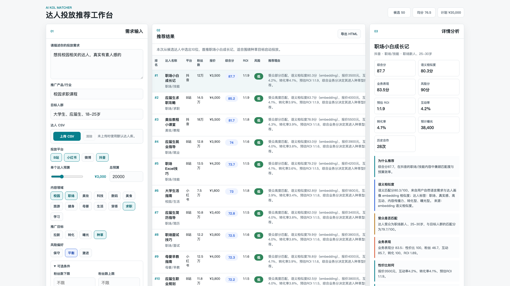

# AI KOL Matcher

AI KOL Matcher 是一个面向品牌市场部、投放专员和营销负责人的达人投放推荐工作台，用本地达人库、规则评分和可选的 Qwen 语义能力，快速筛选适合本次推广需求的 TOP 10 KOL。



## 项目简介

品牌做 KOL 投放时，通常需要同时判断平台、内容领域、受众画像、报价、互动率、转化率、历史合作和风险备注。这个项目把这些维度整理成一个可运行的本地 Web 工作台：用户输入自然语言需求或结构化筛选条件后，系统会从达人 CSV 中筛选候选人，计算综合分、ROI 和风险等级，并给出可解释的推荐理由。

项目当前是一个 Demo/MVP：核心推荐链路、前端工作台、默认达人库、CSV 上传、HTML 导出和 Markdown 报告备用流程已经可用；生产级账号体系、数据库持久化和线上部署配置暂未接入。

## 核心功能

- **投放需求输入**：支持自然语言需求、推广产品/行业、目标人群、平台、预算、内容领域、推广目标和风险偏好。
- **默认达人库推荐**：内置 `data/kol_database.csv`，包含 89 位模拟达人，覆盖小红书、抖音、B站、微博等平台。
- **自定义达人 CSV 上传**：前端可上传 CSV，后端会做字段别名识别、必填列校验、数值清洗和 5MB 大小限制。
- **多维度筛选与评分**：结合平台、预算、领域、粉丝量、互动率、转化率、受众匹配、成本效率、历史合作和风险备注生成综合分。
- **语义匹配增强**：配置 DashScope API Key 后，可用 Qwen 做自然语言结构化抽取，并用 `text-embedding-v4` 计算需求与达人画像的 embedding 相似度；未配置时自动降级到本地规则。
- **TOP 10 推荐结果**：输出排名、达人名称、平台、粉丝数、报价、综合分、ROI、风险和推荐理由。
- **详情分析**：点击推荐结果后展示语义相似度、业务表现、风险分、互动率、转化率、预计曝光、推荐原因和内容合作建议。
- **报告导出**：前端支持导出 HTML 推荐报告；命令行备用模式可导出 Markdown 报告到 `output/report.md`。

## 项目亮点

- **排名可复现**：LLM 不直接决定排名，排序由规则和结构化数据完成，AI 主要用于需求理解与文案解释。
- **无 Key 也可演示**：没有 `DASHSCOPE_API_KEY` 时，推荐链路仍可通过本地规则兜底跑通。
- **数据格式友好**：达人 CSV 支持中英文表头别名，例如 `kol_name`、`达人名称`、`platform`、`平台`。
- **适合 3-5 分钟演示**：从填写需求、生成 TOP 10、查看详情到导出报告，流程集中在一个页面内完成。

## 技术栈

- **语言**：Python 3
- **Web 服务**：`http.server.ThreadingHTTPServer`
- **前端**：原生 HTML、CSS、JavaScript
- **数据处理**：pandas、numpy
- **AI 能力**：OpenAI Python SDK 调用 DashScope OpenAI 兼容接口，默认聊天模型 `qwen-turbo`，默认 embedding 模型 `text-embedding-v4`
- **配置管理**：python-dotenv
- **数据存储**：CSV 文件与本地 JSON embedding 缓存

## 项目结构

```text
.
├── static/
│   ├── index.html          # Web 工作台页面
│   ├── app.js              # 前端交互、CSV 上传、推荐请求、HTML 导出
│   └── styles.css          # 页面样式
├── data/
│   └── kol_database.csv    # 默认达人库
├── docs/
│   └── homepage.png        # README 推荐结果页截图
├── api.py                  # 推荐服务入口，串联筛选、评分、ROI 与理由生成
├── web_app.py              # 本地 HTTP 服务与静态资源/API 路由
├── main.py                 # 项目主入口，默认启动 Web 工作台
├── embeddings.py           # embedding 语义相似度与缓存
├── requirement_extractor.py# 自然语言需求抽取，含规则兜底
├── filter.py               # 达人筛选逻辑
├── scorer.py               # 综合评分与排序
├── roi.py                  # ROI、曝光、转化估算
├── report.py               # 推荐理由、投放建议、Markdown 报告
├── utils.py                # 数据加载、CSV 标准化、LLM 客户端
├── requirements.txt        # Python 依赖
└── 01_场景说明.md 等       # 需求、输入输出、验收标准文档
```

## 快速开始

### 1. 克隆项目

```bash
git clone https://github.com/JoshuaZ16/AI-KOL-Matcher.git
cd AI-KOL-Matcher
```

### 2. 创建虚拟环境并安装依赖

```bash
python3 -m venv .venv
source .venv/bin/activate
pip install -r requirements.txt
```

### 3. 可选：配置 DashScope

不配置 API Key 也可以运行，系统会使用本地规则兜底。需要启用 Qwen 需求抽取和 embedding 语义相似度时：

```bash
cp .env.example .env
```

然后在 `.env` 中填入：

```env
DASHSCOPE_API_KEY=your_dashscope_api_key_here
DASHSCOPE_EMBEDDING_MODEL=text-embedding-v4
```

### 4. 启动 Web 工作台

```bash
python main.py
```

浏览器打开：

```text
http://127.0.0.1:8000
```

如果 8000 端口被占用，可以指定其他端口：

```bash
python main.py --port 8010
```

## 使用说明

1. 在“需求输入”中填写投放需求，例如目标受众、推广产品、平台、预算和内容领域。
2. 可选择上传自定义达人 CSV；不上传时使用内置默认达人库。
3. 点击“生成 TOP10 推荐”，查看推荐列表、平均分、候选数量和计划花费。
4. 点击任一达人行，在右侧查看语义相似度、业务表现、ROI、风险和合作建议。
5. 推荐结果生成后，可点击“导出 HTML”保存本次推荐报告。

自定义达人 CSV 至少需要包含以下字段，支持对应中文别名：

```text
kol_name, platform, followers, field, price, engagement_rate, conversion_rate, audience
```

可选字段包括：

```text
kol_id, avg_likes, avg_comments, cooperation_count, risk_note
```

## 命令行备用导出

项目也保留了命令行交互式 Markdown 导出流程：

```bash
python main.py --cli-export-md
```

运行后按提示输入需求，推荐报告会写入 `output/report.md`。`output/` 是本地运行产物，默认不提交到仓库。

## 当前完成度

已完成：

- 本地 Web 工作台和推荐 API
- 默认达人库加载与自定义 CSV 上传
- 平台、预算、领域及可选指标筛选
- 综合评分、TOP 10 排序、ROI 估算和风险等级
- Qwen 需求抽取、embedding 语义匹配及规则兜底
- 推荐详情分析、HTML 导出和 Markdown 备用报告

部分完成：

- AI 文案能力已接入，但推荐详情中仍保留模板兜底，适合 Demo 和原型验证
- embedding 缓存为本地 JSON 文件，适合小规模数据，不适合多人并发生产环境

暂未完成：

- 用户登录、权限管理和团队协作
- 数据库持久化、达人数据后台管理和投放历史追踪
- 自动化测试套件、CI/CD 和线上部署配置
- 真实平台数据抓取或第三方投放平台集成

## 后续规划

- 增加测试用例，覆盖 CSV 标准化、筛选、评分、ROI 和 API 返回结构。
- 增加达人库管理页面，支持新增、编辑、删除和批量导入。
- 引入投放历史数据，优化评分权重和复投建议。
- 支持多项目/多客户的推荐记录保存与对比。
- 补充 Docker 部署或云服务部署方案。

## 许可证

暂未指定。

## 作者

JoshuaZ16
